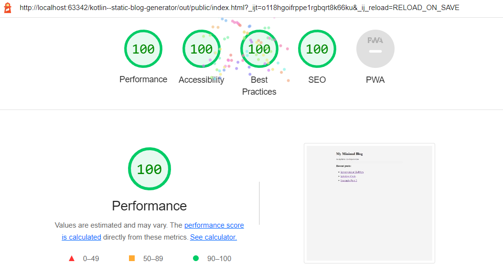

# kotlin--static-blog-generator
Create a minimal static blog using Kotlin.

Usage:
1. Adjust the home page template and post page template, as needed
2. Add blog posts to src/main/resources/__posts/
3. Run the app
4. See the output in out/public/

Notes:
- Resource directories that start with `__` (like `__posts/`) are NOT copied to the output directory. All other directories and content are copied.

Awards: Perfect Google Lighthouse score of 100

TODO:
- Add ability to generate other pages
